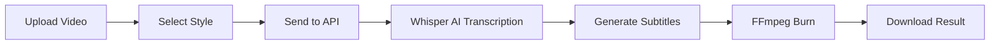

# SubsGen - Instagram Subtitle Generator

<div align="center">


**Generate viral Instagram-style subtitles for your videos in seconds**

[Live Demo](https://subsgen-frontend-7pq3ad0ku-prabhakar-elavalas-projects.vercel.app) • [Backend API](https://prabhakarelavala-instagram-subtitles-api.hf.space)

[](https://vercel.com)
[](https://nextjs.org)
[](https://typescriptlang.org)
[](https://tailwindcss.com)

</div>

---

## ✨ Features

- **🎬 Word-by-Word Highlighting** - Viral Hormozi/CapCut style subtitles
- **🎨 6 Unique Styles** - Choose from Hormozi, Minimal, Neon, Fire, Karaoke, Purple
- **🤖 AI-Powered** - Automatic speech recognition using Whisper AI
- **⚡ Fast Processing** - Optimized for speed with faster-whisper
- **🆓 100% Free** - No watermarks, no sign-up required
- **📱 Mobile Friendly** - Works on all devices

---

## 🎨 Subtitle Styles

| Style | Description | Best For |
|-------|-------------|----------|
| **Hormozi** | Yellow highlights on white text | Business, motivational content |
| **Minimal** | Clean white text | Professional, corporate |
| **Neon Glow** | Cyan/magenta glowing effect | Gaming, tech content |
| **Fire** | Orange/red highlights | High energy, sports |
| **Karaoke** | Green word highlights | Music, entertainment |
| **Purple Vibes** | Purple aesthetic | Lifestyle, beauty |

---

## 🚀 Getting Started

### Prerequisites

- Node.js 18+
- npm or yarn

### Installation

```bash
# Clone the repository
git clone https://github.com/prabhakar1234pr/subsgen-frontend.git

# Navigate to the directory
cd subsgen-frontend

# Install dependencies
npm install

# Create environment file
cp env.example .env.local
```

### Environment Variables

Create a `.env.local` file with:

```env
NEXT_PUBLIC_API_URL=https://prabhakarelavala-instagram-subtitles-api.hf.space
```

### Development

```bash
# Start development server
npm run dev
```

Open [http://localhost:3000](http://localhost:3000) in your browser.

### Production Build

```bash
# Build for production
npm run build

# Start production server
npm start
```

---

## 📁 Project Structure

```
frontend/
├── app/
│   ├── page.tsx          # Main upload page
│   ├── layout.tsx        # Root layout with fonts
│   └── globals.css       # Global styles & animations
├── components/
│   ├── VideoUploader.tsx     # Drag & drop upload
│   ├── StyleSelector.tsx     # Subtitle style picker
│   ├── ProcessingStatus.tsx  # Progress indicator
│   └── VideoPreview.tsx      # Result preview & download
├── public/               # Static assets
├── package.json
├── tailwind.config.js
└── next.config.js
```

---

## 🛠️ Tech Stack

| Technology | Purpose |
|------------|---------|
| **Next.js 14** | React framework with App Router |
| **TypeScript** | Type safety |
| **Tailwind CSS** | Styling |
| **Lucide React** | Icons |
| **Vercel** | Deployment |

---

## 🔌 API Integration

The frontend communicates with a FastAPI backend hosted on Hugging Face Spaces.

### Endpoint

```
POST /api/process
```

### Request

```typescript
const formData = new FormData();
formData.append("video", file);
formData.append("style", "hormozi"); // Style ID

const response = await fetch(`${API_URL}/api/process`, {
  method: "POST",
  body: formData,
});
```

### Response

Returns the processed video file with burned-in subtitles.

---

## 🎯 How It Works



1. **Upload** - User uploads a video file (MP4, MOV, WebM)
2. **Style Selection** - Choose from 6 subtitle styles
3. **Processing** - Backend transcribes audio and generates subtitles
4. **Download** - Get the video with burned-in subtitles

---

## 📱 Responsive Design

The UI is fully responsive and works on:

- ✅ Desktop (1920px+)
- ✅ Laptop (1024px)
- ✅ Tablet (768px)
- ✅ Mobile (375px)

---

## 🚢 Deployment

### Vercel (Recommended)

1. Fork this repository
2. Go to [vercel.com](https://vercel.com)
3. Import the repository
4. Add environment variable:
   - `NEXT_PUBLIC_API_URL` = Your backend URL
5. Deploy!

### Manual Deployment

```bash
npm run build
npm start
```

---

## ⚙️ Configuration

### Supported Video Formats

- MP4 (.mp4)
- QuickTime (.mov)
- WebM (.webm)
- AVI (.avi)

### Limits

- **Max file size**: 100MB
- **Max duration**: ~3 minutes (recommended)
- **Language**: English only

---

## 🤝 Contributing

Contributions are welcome! Please feel free to submit a Pull Request.

1. Fork the repository
2. Create your feature branch (`git checkout -b feature/AmazingFeature`)
3. Commit your changes (`git commit -m 'Add some AmazingFeature'`)
4. Push to the branch (`git push origin feature/AmazingFeature`)
5. Open a Pull Request

---

## 📄 License

This project is open source and available under the [MIT License](LICENSE).

---

## 🙏 Credits

- [OpenAI Whisper](https://github.com/openai/whisper) - Speech recognition
- [faster-whisper](https://github.com/guillaumekln/faster-whisper) - Optimized Whisper
- [FFmpeg](https://ffmpeg.org/) - Video processing
- [Next.js](https://nextjs.org/) - React framework
- [Tailwind CSS](https://tailwindcss.com/) - Styling
- [Lucide](https://lucide.dev/) - Icons

---

<div align="center">

**Made with ❤️ for content creators**

[Report Bug](https://github.com/prabhakar1234pr/subsgen-frontend/issues) • [Request Feature](https://github.com/prabhakar1234pr/subsgen-frontend/issues)

</div>

